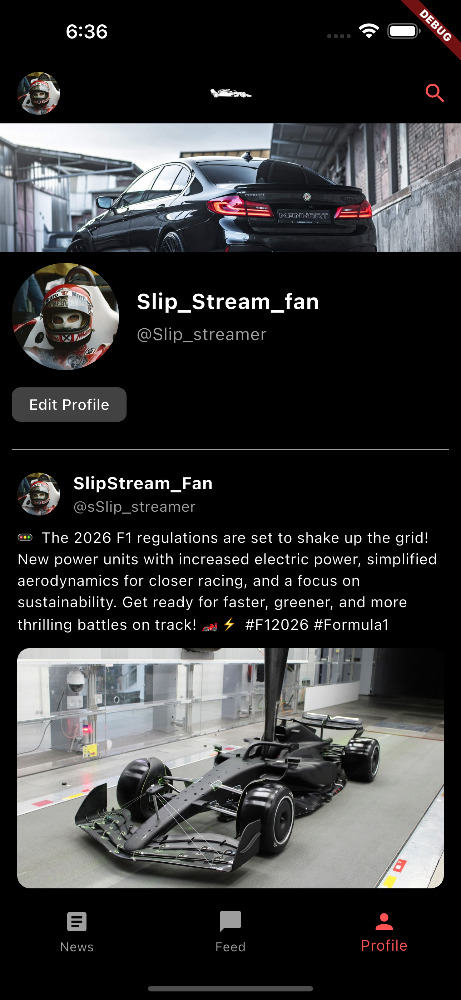
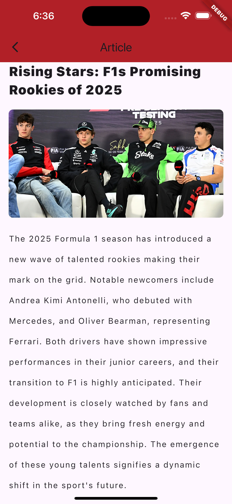

# 🏎️ Slip Stream ƪ( ` ▿▿▿▿ ´ ƪ)

*A curated social media experience for Formula 1 fans — where racing news meets community.*

---

## 📌 Overview

**Slip Stream** is a mobile-first Formula 1 news and social feed app built with Flutter and powered by a Node.js backend.

The current development cycle has been **re-scoped** after careful review ┻━┻ ︵ヽ(`Д´)ﾉ︵ ┻━┻

We’re now focused on:
- 📄 A **News** screen with curated Formula 1 updates
- 🗨️ A **Feed** screen with user-generated posts
- 👤 A **Profile** screen showing posts and bio

This is an ongoing portfolio project — built solo, built with love, and built with speed. (≧▽≦)

### Main Screens
| News Screen | Profile Screen | Feed Screen | Article Screen | Auth Screen | 
|-------------|---------------|---------------|----------------|------------|
|  
|  
|  
|  
|  
|

---

## ⚙️ Tech Stack (Current)

| Layer        | Technology                     |
| ------------ | ----------------------------- |
| **Frontend** | Flutter (iOS-only for now)     |
| **Backend**  | Node.js + Express              |
| **Database** | PostgreSQL                     |
| **Auth**     | JWT in development, Clerk later |
| **F1 News**  | Currently using local data     |
| **Infra**    | Dev-mode only                  |
| **AWS**      | Stretch goal for image upload  |

---

## 📸 Screenshots

_📷 Screenshots will go here soon – stay tuned!_

---

## 🧭 Current Progress

### ✅ Implemented
- Flutter app structure
- Feed screen with dummy posts
- News screen using local placeholder articles + images
- Profile screen with avatar, name, and static bio
- Node.js + Express backend with basic routes
- PostgreSQL set up via Railway

### 🔧 In Development
- REST API for `/posts`, `/feed`, and `/profile`
- Post creation UI (done)
- Backend validation
- Comment system

---

## ✈️ What's Next?

- Expand database models
- Integrate dynamic F1 news from a real API
- Add basic JWT-based user authentication
- Polish UI for iPhone 15 Pro Max
- Optional: Add AWS S3 image uploads if time permits

---

## 🗃️ Folder Structure

slip_stream/
├── backend/                        # Node.js + Express + PostgreSQL backend
│
├── assets/                         # Article images and other UI assets
│
├── lib/
│   ├── auth/
│   │   └── auth_screen.dart        # Sign in / Sign up screen
│   │
│   ├── constants/                  # App-wide constants (if any)
│
│   ├── data/
│   │   └── place_holder_articles.dart   # Local news data
│
│   ├── loading_screens/
│   │   ├── loading_feed.dart
│   │   └── loading_news.dart
│
│   ├── tabs/
│   │   ├── article_content_controller.dart
│   │   ├── create_post.dart
│   │   ├── feed_screen.dart
│   │   ├── news_screen.dart
│   │   ├── profile_screen.dart
│   │   └── stats_screen.dart
│
│   ├── widgets/
│   │   ├── article_detail_screen.dart
│   │   ├── custom_button.dart
│   │   ├── custom_text_field.dart
│   │   └── main_home.dart          # Main tabbed navigation view
│
│   └── main.dart                   # Flutter entry point
│
├── README.md

🧪 Dev Notes
Postgres is running on Railway (dev-only)

JWT auth is the current auth method (Clerk planned for prod)

News articles currently sourced from local assets

Backend will expose REST API endpoints incrementally

👨‍💻 Author
👤 Timothy Itayi
🇦🇺 Based in Melbourne, Australia
🛠️ Focused on building creative, mobile-first full-stack apps
💬 Always learning, always building (ง'̀-'́)ง

🎯 Future Scope
Fully integrate Clerk for user auth

Real-time race stats and standings

Public post explore tab

Motorsports community expansion (WEC, MotoGP, etc.)

Thanks for checking out Slip Stream! If you love F1, mobile apps, or flipping tables in excitement, you’re in the right garage.
(╯°□°）╯︵ ┻━┻

